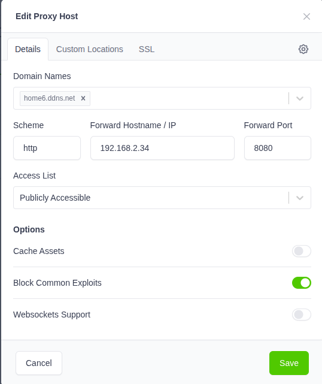
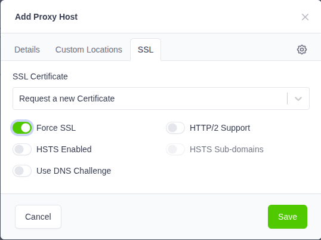

# openhab-deploy
Openhab deployment

Target:
- two deployments with one docker compose configuration file
- secure access using internet

## Two deployments
Use a script to start the docker compose image [run_openhab](./run_openhab.bash) with two options:
- the deployment envronment [home|church]
- the action for the docker compose image [start|stop|status]

Each deployment has an own configuration setting:
- [home](./home/.env)
- [church](./church/.env)

## Secure access
Use the proxy docker-compose file to start the proxy

### Configuration Steps (The "How-To")
- Router Setup: On your router (at Home and at Church), forward ports 80 and 443 to the Ubuntu server's local IP address.
- DNS: Point your domain (e.g., home.yourdomain.com) to your public IP. If you have a dynamic IP, use a DDNS service like DuckDNS or No-IP.
- Login to NPM: Open http://<your-server-ip>:81. (Default: admin@example.com / changeme).
- Add Proxy Host:
>>Domain Names: home.yourdomain.com
>>Scheme: http
>>Forward IP: openhab-home (or the local IP of the server)
>>Forward Port: 8080
- Block Common Exploits: Enable this.
- SSL Tab:
>>Select Request a new SSL Certificate.
>>Enable Force SSL (this ensures all traffic is encrypted).
>>Agree to Let's Encrypt TOS and Save.

## Startup
Create DNS records using NO-IP

| deployment | domain           | IP          |
|-----------:|-----------------:|------------:|
| home       | home6.ddns.net   | <home ip>   |
| church     | church6.ddns.net | <church ip> |


Verify there is a proxy_network

```bash
docker network create proxy_network
```

Start the proxy [run_proxy](./run_proxy.bash)

Configure the proxy

### Proxy hosts


### Certificates
